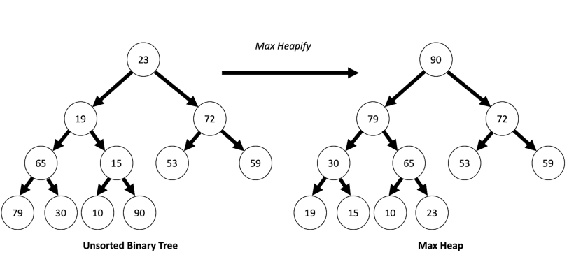
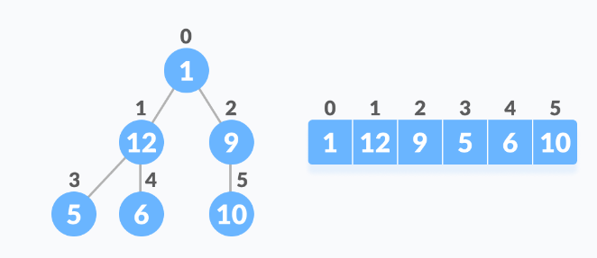

# Heap 

A heap is a specialized tree-based data structure in computer science that satisfies the heap property. It is commonly implemented as a binary heap, where each parent node has a value greater than or equal to its children (max heap) or less than or equal to its children (min heap). The heap property allows for efficient extraction of the maximum (or minimum) element and efficient insertion of new elements.

<hr>
<br>

## Heapify
Heapify is an algorithm used to convert a binary tree into a heap data structure.



The heapify function is typically called starting from the last non-leaf node in the heap and then recursively applied to its parent nodes until the root node is reached.
In a binary heap, the last non-leaf node can be found at  **(n//2) - 1,** where n is the total number of elements in the heap.

## Max Heap and Min Heap
### Max heap

* The root is having the biggest element, when comparing with the descendents 
* It is a complete binary tree
#### **Insertion**
* The element is inserted as a leaf to the left side of the tree.
* It is inserted into the left side in order to preserve the complete binary tree property
* It is then adjusted by comparing it with the root.
* Adjustment is made from leaf towards root.

> Time complexity : **O(1) to O(log n)** , swapping is based of height of the tree

#### **Deletion**
* Only root element is deleted
* The remaining elements are adjusted in a way to preserve the complete binary tree property
* The last element is swapped with the deleted root element
* Then the remaining elements are adjusted to maintain max heap
* The adjustment is made from root towards leaf
> Time complexity : **O(1) to O(log n)** ,depending on the height of the tree and the need for swapping.


```
When an element is deleted, an empty location is created in the last location. 
It is an empty location. The recently deleted element can be stored in that empty location(last array location).
This last location is outside of heap.
```

### Min Heap
* In a min heap, the root holds the smallest element when comparing it with its descendants.
* Similar to a max heap, it is also a complete binary tree.
#### **Insertion**:
* To maintain the complete binary tree property, the new element is inserted as a leaf on the left side of the tree.
* This left-side insertion ensures that the tree remains complete.
* After insertion, the element is adjusted by comparing it with its parent nodes.
* The adjustment process starts from the leaf and moves towards the root.
* If the new element is smaller than its parent, they are swapped to maintain the min heap property.
> Time complexity: **O(1) to O(log n),** depending on the height of the tree and the need for swapping.

#### **Deletion:**
* In a min heap, only the root element is deleted.
* After deletion, the remaining elements are adjusted to preserve the complete binary tree property.
* The last element in the heap is swapped with the deleted root element.
* Then, the remaining elements are adjusted to maintain the min heap property.
* The adjustment process starts from the root and moves towards the leaf.
* Swapping is performed as necessary to ensure that the smaller elements bubble up towards the top.
> Time complexity: **O(1) to O(log n),** depending on the height of the tree and the requirement for swapping.
```
When an element is deleted, an empty space is created in the last location of the heap.
This empty space is located outside of the actual heap structure.
The recently deleted element can be stored in this last location, allowing for efficient memory management.
```

<hr>
<br>

## Relationship between Array Indexes and Tree Elements
If the index of any element in the array is *i*, the element in the index *2i+1* will become the left child and element in *2i+2* index will become the right child.

* i = index of the element
* 2i+1 = left child
* 2i+2 = right child



* Root element: 1 is the root element in the 0th index posistion.
* In the first row,  the value of i is 0.
* Left element: (2i+1) ie, (2*0+1) ==> 1st index posistion of the element. ==> 12.
* Right element: (2i+2) ==> (2*0+2) ==>  2nd index posistion. ==> 9.


## Heap Sort
>**👋**
> The heapify function is typically not called on leaf nodes during the construction of a max heap or during the sorting process in heap sort. This is because leaf nodes do not have any children, and therefore there is no need to perform heapify on them.

### Heap sort involves two main steps:

1. **Building a Max Heap:** 
* The given array is first converted into a max heap. 
* This step rearranges the elements in the array so that they satisfy the heap property, which means the value of each node is greater than or equal to the values of its children (for a max heap). 
* This process typically involves using a function called heapify to adjust the elements and maintain the heap property.


2. **Sorting the Heap:** 
* After the max heap is constructed, the largest element (which is at the root) is swapped with the last element in the array. 
* The heap size is reduced by 1, and then the heapify function is called on the root to restore the heap property. * This swapping and heapify process is repeated for the remaining elements in reverse order until the entire array is sorted.

**Time complexity :** O(n log n), there are n elements. each elements takes log n time for finding its posistion in the heap. The log n is based on the height of the tree.

```python
# Heapify function
def heapify(Arr, n, i):
    largest = i
    left = 2 * i + 1
    right = 2 * i + 2

    if left < n and Arr[left] > Arr[largest]:
        largest = left

    if right < n and Arr[right] > Arr[largest]:
        largest = right

    if largest != i:
        Arr[i], Arr[largest] = Arr[largest], Arr[i]
        heapify(Arr, n, largest)

# Heap sort
def heapSort(Arr):
    n = len(Arr)

    for i in range(n // 2 - 1, -1, -1):
        heapify(Arr, n, i)

    for i in range(n - 1, 0, -1):
        Arr[0], Arr[i] = Arr[i], Arr[0]
        heapify(Arr, i, 0)

Arr = [2, 66, 30, 5, 9, 10]
n = len(Arr)

heapSort(Arr)

# Printing the result
print("Sorted array:")
for i in range(n):
    print(Arr[i])


# Output :
Initial array: 2, 66, 30, 5, 9, 10
Sorted array: 2,5,9,10,30,66
```